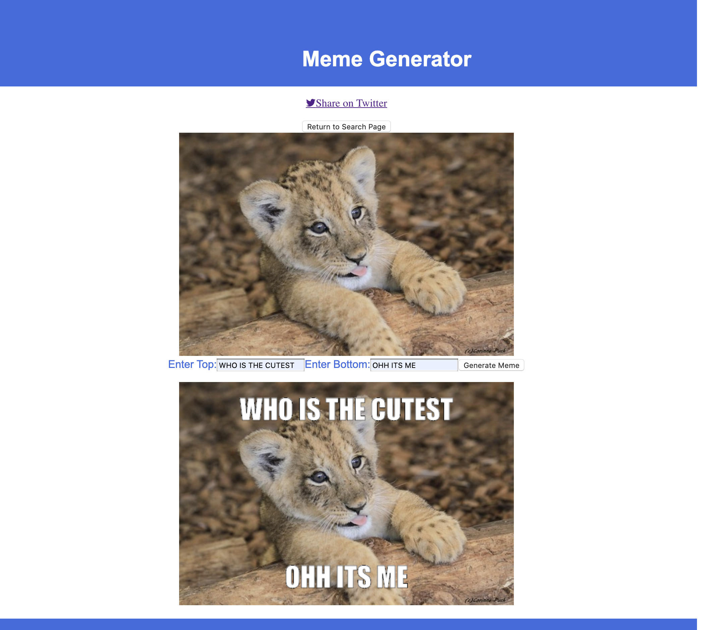

# Meme-Generator

A React/JS web app that lets user search pics, displays search results, then generates a meme with a user chosen image and input texts.
--------------------------------------------------------
## Check it out
https://gnrmeme.herokuapp.com/

--------------------------------------------------------
## How it works:

1. provide an input that allows a user 
2. search for images on Flickr that match a given string
3. present search results:  images 
4. then allow a user to select one 
5. allow a user to enter some text that appears on top and bottom of the image


--------------------------------------------------------

## Interfaces:

* 50 sec youtube clip:
    * https://youtu.be/vBtyZzfLBXM

* Search Interface:
    * 

* Generate Interface:
    * 


--------------------------------------------------------

## Install Instructions:

1. Download the repo and unzip
    * git clone https://github.com/yiransii/Meme-Generator.git
    * Or, download ZIP on github repo main page
2. Navigate to directory Meme-Generator-master
3. Run the following command: ./bin/install
4. Run the following command: ./bin/run
5. Open a browser(chrome preferred), and navigate to localhost:8000/search/

--------------------------------------------------------
## Install Errors:

1. port 8000 already in use:
    * modify [--port 8000] in the last line in /bin/run to any available port on your local machine. e.g. [--port 8888]
2. package not found:
    * please install missing packages with pip, or sudo apt get, or brew install
3. others:
    * please let me know: yiransi@umich.edu

--------------------------------------------------------
## Structures:

* search:
    * display input box, takes query
    * fetch img from Flickr and display imgs
    * if user lick on any img, jump to generate: <a href="/generate/img={img_url}">
* generate:
    * if request.get.img = None, alert user
    * get text msg that user wanna put on img
    * use canvas. getelementbyid. draw methods
```
.
├── README.md
├── bin
│   ├── install
│   └── run
├── examples
│   ├── generate_interface.jpg
│   └── search_interface.jpg
├── meme
│   ├── meme
│   │   ├── __init__.py
│   │   ├── api            <---- python files
│   │   │   ├── __init__.py
│   │   │   └── main.py
│   │   ├── config.py
│   │   ├── js             <---- javascripts files      
│   │   │   ├── generate.jsx
│   │   │   ├── main.jsx
│   │   │   └── search.jsx
│   │   ├── static         
│   │   │   └── js         
│   │   │       └── bundle.js
│   │   ├── templates      <---- html files
│   │   │   ├── generate.html
│   │   │   └── search.html
│   │   └── views
│   ├── meme.egg-info
│   │   ├── PKG-INFO
│   │   ├── SOURCES.txt
│   │   ├── dependency_links.txt
│   │   ├── requires.txt
│   │   └── top_level.txt
│   ├── package-lock.json
│   ├── package.json
│   ├── setup.py
│   └── webpack.config.js
└── package-lock.json

```


--------------------------------------------------------
## Develop Notes:

1. For javascript: npx webpack --watch 

2. Flickr API usage:
    *  The Photo Source URLs page in the documentation explains it: You can construct the source URL to a photo once you know its ID, server ID, farm ID, and secret, as returned by many API methods. The URL takes the following format: https://farm{farm-id}.staticflickr.com/{server-id}/{id}_{secret}.jpg

    * fetch a list of img: https://api.flickr.com/services/rest/?method=flickr.galleries.getPhotos&api_key=APIKEY&gallery_id=66911286-72157647277042064&format=json&nojsoncallback=1 || https://api.flickr.com/services/rest/?method=flickr.photos.search&api_key=21464a195f014a8659b27ffc98d3ca7c&

    * Flickr API: https://idratherbewriting.com/learnapidoc/docapis_flickr_example.html || https://www.flickr.com/services/api/misc.urls.html || https://www.flickr.com/services/api/
